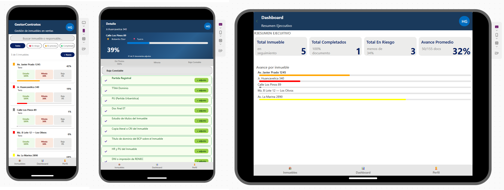
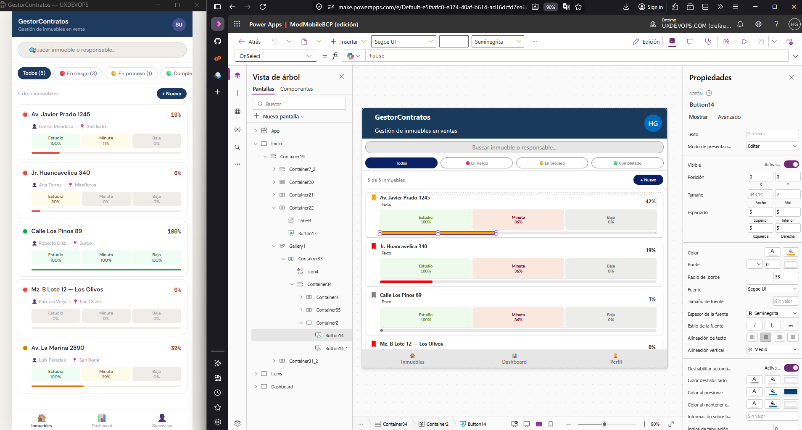

# GestorContratos — UI Responsive
**by UXDEVOPS**

App mobile para seguimiento de contratos inmobiliarios. Construida en Power Apps Canvas con diseño responsive para tablet y móvil.

---

## Vista previa

---

## ¿Qué hace?

- Seguimiento por etapas: Estudio → Minuta → Baja escritura
- Estados visuales: En riesgo / En proceso / Completado
- Filtros rápidos y buscador
- Progreso por inmueble en tiempo real
- Layout adaptado a móvil y tablet

---

## Descarga

El archivo `.msapp` está incluido en este repositorio.  
Importa directo desde **Power Apps Studio → Abrir → Examinar archivos**.

---

## Stack

`Power Apps Canvas` · `PowerFX` · `SharePoint / Dataverse`

---

> Desarrollado por [UXDEVOPS](https://uxdevops.com) — Hugo Alexis Gutiérrez
